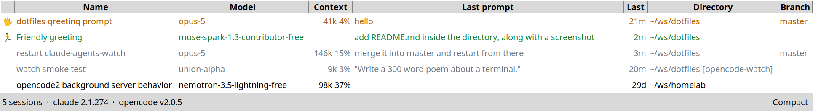

# busywork

A small always-on-top window listing your coding-agent sessions: background
and interactive [Claude Code](https://docs.anthropic.com/en/docs/claude-code)
sessions plus sessions of a running [opencode](https://opencode.ai) server.



Sessions that want you sort first and wave (👋); running ones show a runner
(🏃). Rows are coloured by state — green working, orange blocked, grey done,
red failed — and a session past 90% of its context window goes a brighter
red, whatever its state. The status bar shows the session count and the tool
versions found.

## Requirements

- python3 with tkinter (`python3-tk` on Linux, `brew install python-tk` on macOS)
- `claude` and/or `opencode` on PATH; a missing tool (or a stopped opencode
  server) just contributes no rows

## Running

```sh
busywork             # symlinked into ../bin; or ./busywork from here
busywork --live      # hide finished sessions
```

Options: `--interval SEC` (refresh gap, default 2), `--no-topmost`,
`--alpha A` (opacity, default 0.9). Keys: `t` toggles always-on-top,
`c` toggles compact mode (status, name, model, context only), `q` quits.

Columns are sized to their content and the height follows the row count;
toggling compact sizes the width to the columns too.
`~` stands for `$HOME`; a path like `~/ws/x [wt]` is a worktree.

## How it works

- `busywork` — the window; each tool is a `Source` (`source.py`) that
  yields `Session`s (`session.py`)
- `claude.py` — session list from `claude agents --json`, details from each
  session's transcript under `~/.claude/projects` and, for background jobs,
  what the job says it is doing from `~/.claude/jobs/<id>/state.json`
- `opencode.py` — server URL from `opencode service status`, sessions and
  messages over its HTTP API
- `windows.py` — each model's context window, probed once with a one-token
  `claude -p` call and cached in `~/.cache/busywork/windows.json`

Tests: `pytest` from this directory.
